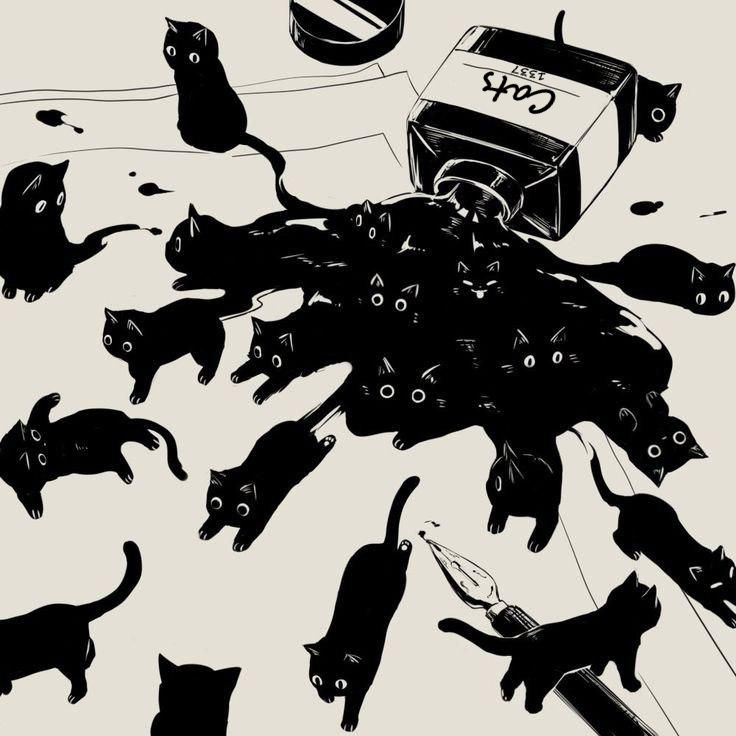

<!--CAT-->

<!--LINE-->
 

 

<!--LINE-->
 

  <h2 style="text-align: center; color: #36BCF7FF; margin-bottom: -5px">Proficient Languages</h2>

<!--LINE-->
  

<table align="center">
  <tr>
  <td align="center" width="48">
      <code></code>
       
LUA

    </td>
    <td align="center" width="48">
      <code></code>
       
Java

    </td>
    <td align="center" width="48">
      <code></code>
       
Python

    </td>
  </tr>
</table>

  <h2 style="text-align: center; color: #36a9dee5; margin-bottom: -5px">Known Languages</h2>

<!--LINE-->
 

<table align="center">
  <tr>
    <td align="center" width="48">
      <code></code>
       
CSS3

    </td>
    <td align="center" width="48">
      <code></code>
       
HTML5

    </td>
    <td align="center" width="48">
      <code></code>
       
JavaScript

    </td>
  </tr>
</table>

  <h2 style="text-align: center; color: #3696c5cc; margin-bottom: -5px">Tools</h2>

<!--LINE-->
 

<table align="center">
  <tr>
    <td align="center" width="48">
      <code></code>
       
VSC

    </td>
    <td align="center" width="48">
      <code></code>
       
Eclipse

    </td>
  </tr>
</table>